# Portafolio de aplicaciones

## Descripción de la aplicación  

* La aplicación consiste en un portafolio de aplicaciones.
* Este portafolio está creado con React.
* El portafolio contiene un encabezado, una sección para el contenido y un pie de página:
    * En el encabezado se muestra un menú de navegación para acceder a las diferentes secciones de contenido del portafolio por medio de links.
    * Las secciones del portafolio son "About me", "Portfolio", "Contact" y "Resume".
    * Cada vez que se presiona un link en el menú de navegación, entonces se accede a la sección especificada y el título de la sección es resaltado.
    * Cuando se accede por primera vez al portafolio, la sección "About me" se selecciona de forma predeterminada.
    * Esta sección de "About me" incluye una foto del desarrollador y una breve biografía.
    * En la sección de "Portfolio" se despliegan imágenes de 6 aplicaciones del desarrollador con sus respectivos títulos, enlaces a las aplicaciones desplegadas y enlaces a los respositorios de GitHub correspondientes.
    * En la sección de "Contact" se muestra un formulario de contacto con campos para que la persona interesada introduzca su nombre, correo electrónico y un mensaje:
        * Cada vez que el usuario mueve el cursor fuera de uno de los campos del formulario sin ingresar texto, entonces aparece un mensaje indicando que es necesario introducir información.
        * Asimismo, cuando se introduce texto en el campo del correo electrónico, se valida si la dirección de correo eletrónica es válida.
    * En la sección de "Resume", se incluye a un currículum descargable y una lista de competencias del desarrollador.
    * En el pie de página, se presentan íconos con enlaces a los perfiles de GitHub, LinkedIn y Twitter del desarrollador.

    
## Enlace a la aplicación funcional

* [Enlace a aplicación en GitHub pages](https://jorgeramirezanzaldo.github.io/Portfolio/)
* Se recomienda abrir el link en modo incógnito para evitar cualquier caché que pueda interferir con la aplicación.

## Instrucciones de instalación  

* Esta aplicación requiere:

      * Instalación de:
        * Node JS versión 16.18.0
        * Paquete gh-pages 5.0.0
        * Paquete react 17.0.2
        * Paquete react-dom 17.0.2
        * Paquete react-icons 4.7.1
        * Paquete react-scripts 5.0.1
        * Paquete web-vitals 2.1.4
        * Paquete @testing-library/jest-dom 5.16.4
        * Paquete @testing-library/react 11.1.0
        * Paquete @testing-library/user-event 13.5.0

## Instrucciones para realizar pruebas 

* La ejecución de la aplicación se tiene que hacer desde la terminal de node.js
* Asegúrate de estar en la ubicación de la carpeta principal/raíz de la aplicación: PORTFOLIO\      
  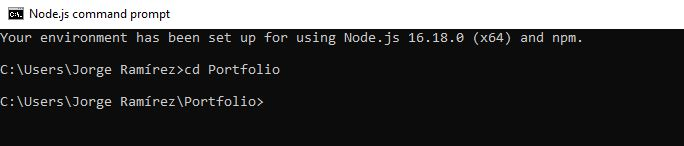  
* Para instalar todos los paquetes necesarios ejecuta el comando "npm install" desde la terminal de node.js  
  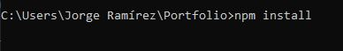  
* Para iniciar la aplicación de react, emplea el comando "npm start" desde la terminal de node.js      
  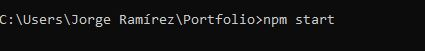  
* A partir de este punto puedes emplear la dirección http://localhost:3000/ para acceder a la aplicación desde un navegador.  
  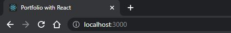  

## Información de uso de la aplicación

* Una vez que hayas accedido a la aplicación mediante el siguiente link de [GitHub Pages](https://jorgeramirezanzaldo.github.io/Portfolio/) o si estás haciendo pruebas locales mediante la dirección http://localhost:3000/:
  * Podrás ver que se despliega el encabezado, el pie de página y la sección de "About me" de forma predeterminada con una fotografía del desarrollador y una breve biografía. Asimismo, el link de "About me" se encuentra resaltado:
      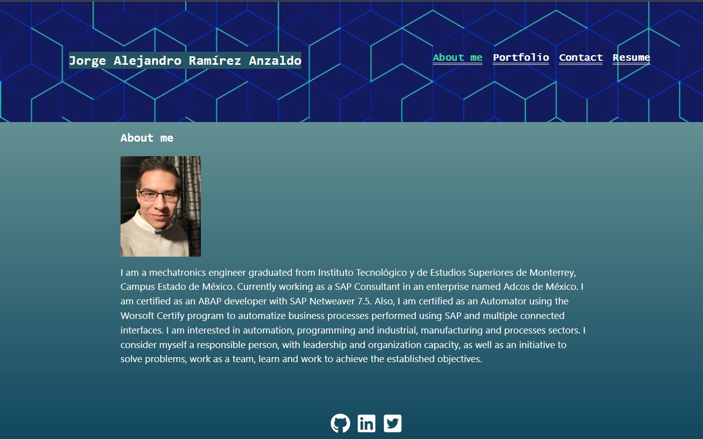   
  * Para ir a la sección de "Portfolio", presiona el link correspondiente en el menú de navegación. Cuando lo presiones, verás el link resaltado y la sección de "Portfolio" con las imágenes de las 6 aplicaciones:    
      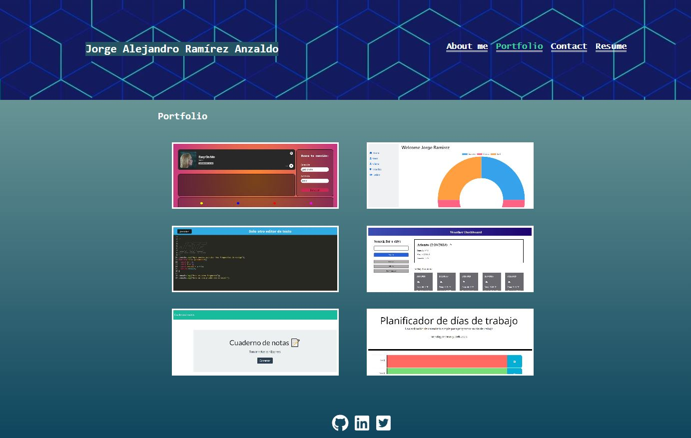   
      * Cuando te posiciones sobre la imagen de una aplicación, entonces se muestra su correspondiente link a la aplicación desplegada y el link al repositorio de GitHub:  
        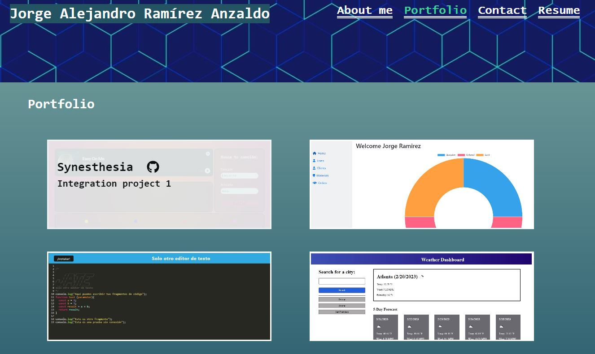   
  * Para ir a la sección de "Contact", presiona el link correspondiente en el menú de navegación. Cuando lo presiones, verás el link resaltado y la sección de "Contact" con el formulario de contacto y se muestra el número telefónico y el correo electrónico del desarrollador:    
      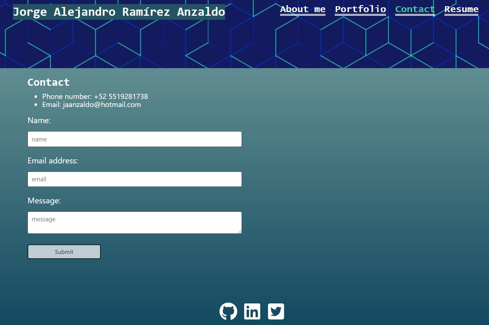  
      * Puedes introducir tu nombre, tu correo electrónico, tu mensaje y presionar el botón de "Submit" para enviar la información.  
        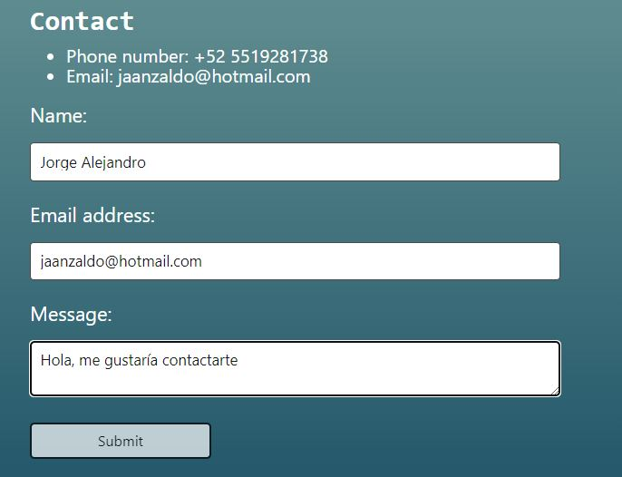  
      * Si te posicionas sobre un campo del formulario y no introduces información, cuando quites el cursor del campo se mostrará un mensaje de error.  
        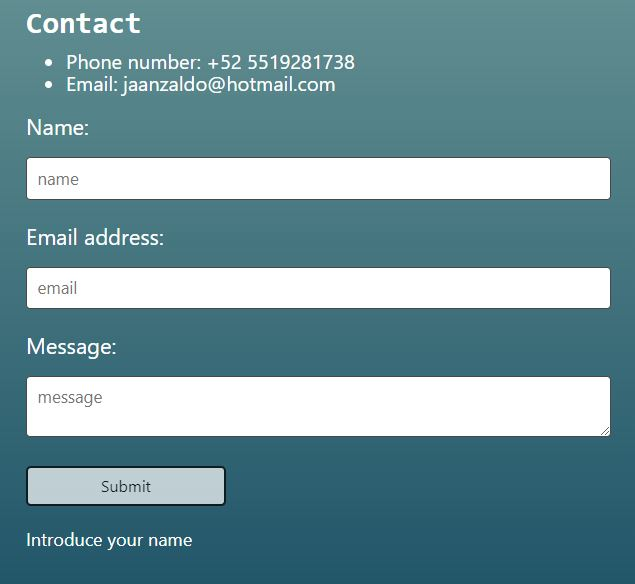  
      * Igualmente se validará el correo electrónico introducido para ver si tiene el formato adecuado. Si está incorrecto aparecerá un mensaje de error.  
        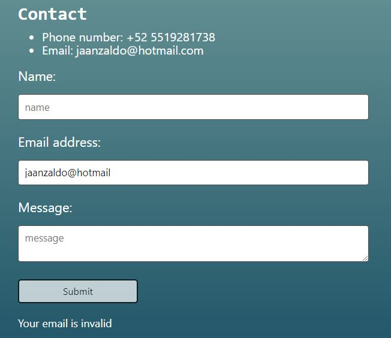  
  * Para ir a la sección de "Resume", presiona el link correspondiente en el menú de navegación. Cuando lo presiones, verás el link resaltado y la sección de "Resume" con un link para descargar el currículum del desarrollador y una lista con una serie de competencias del desarrollador.    
      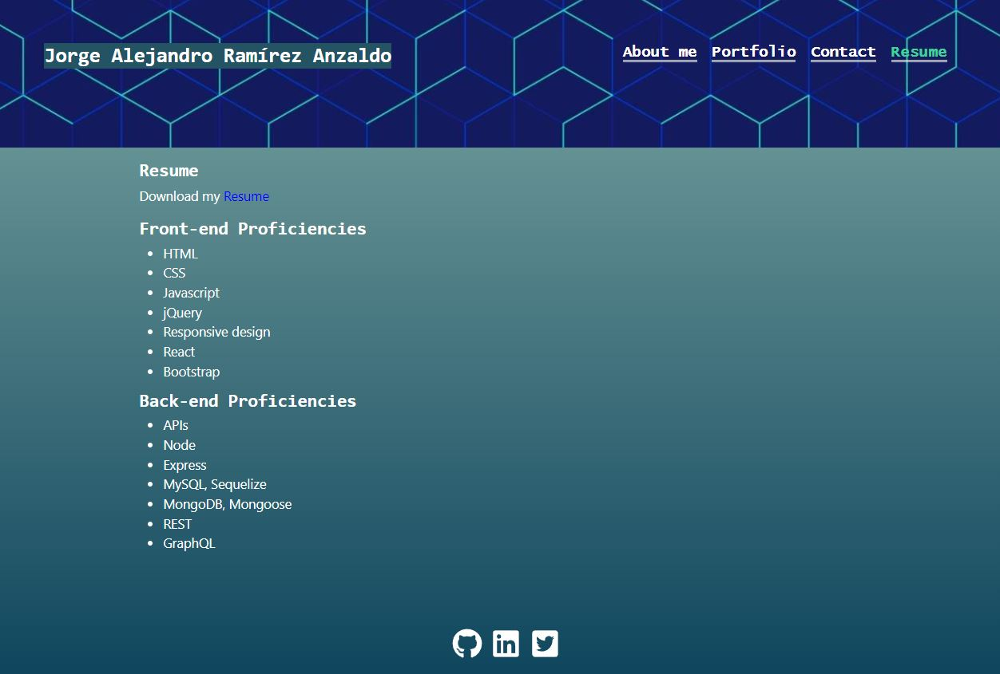  

## Apariencia de la aplicación

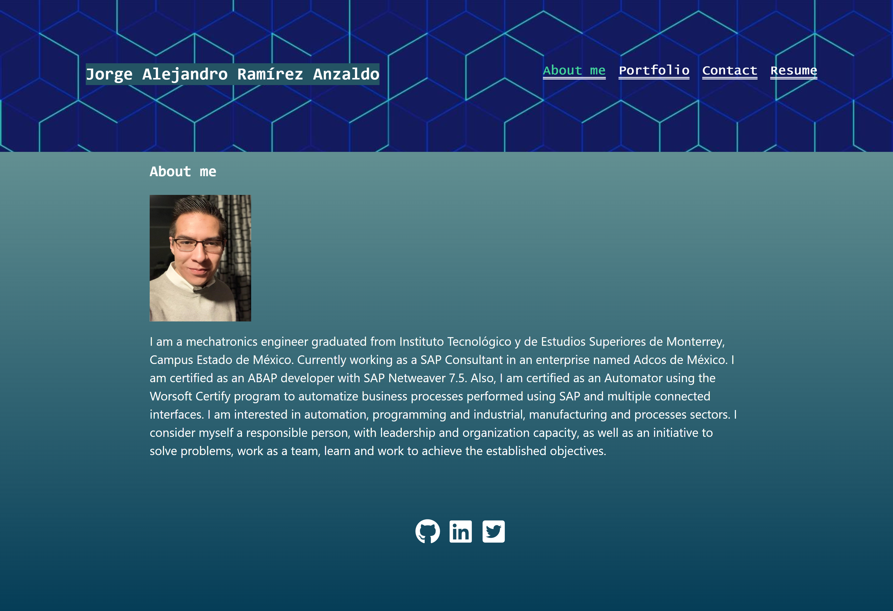    
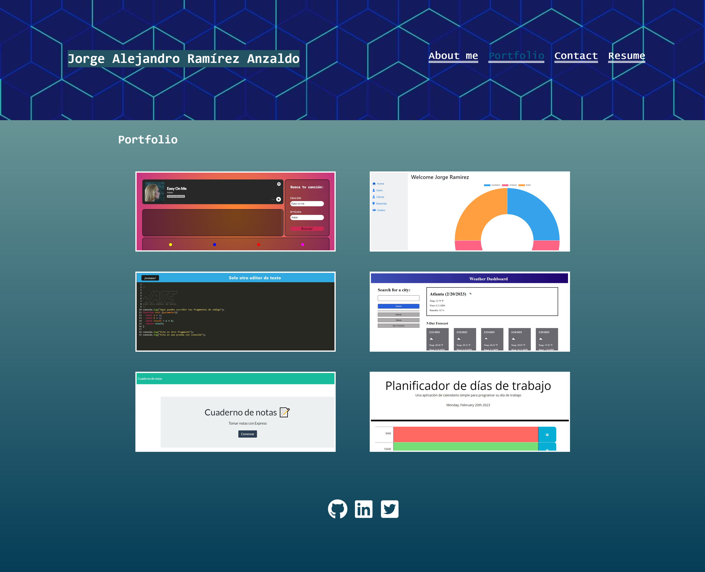    
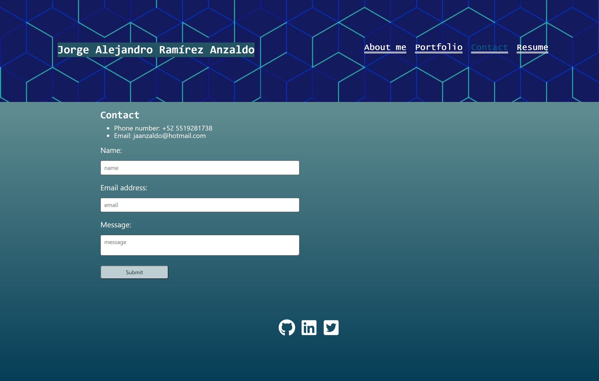    
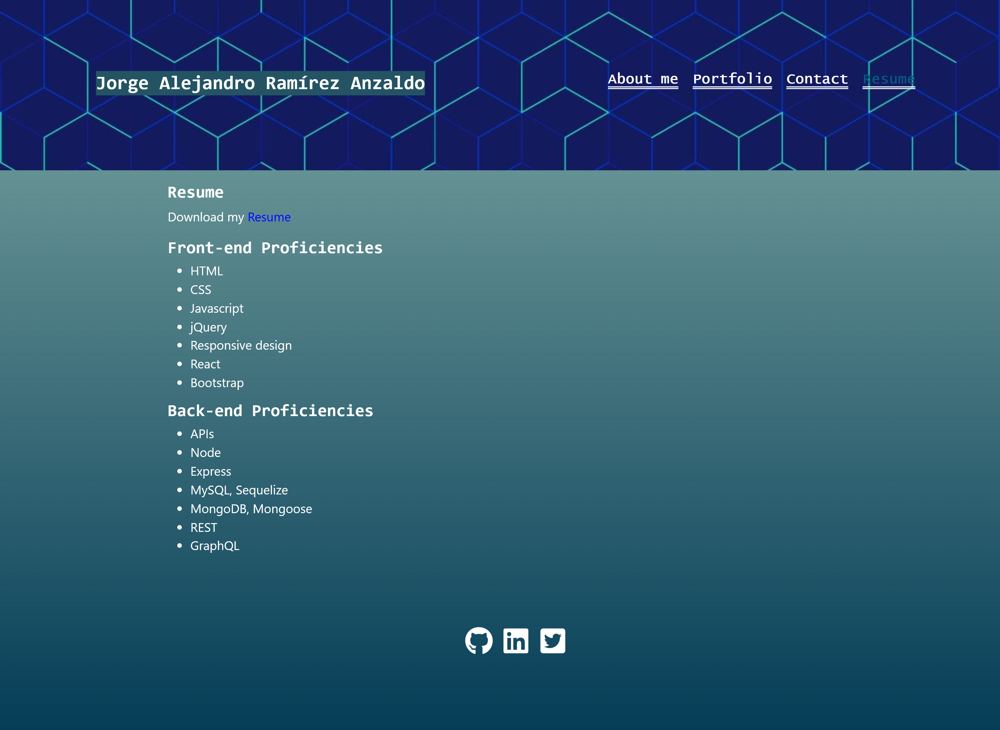    
